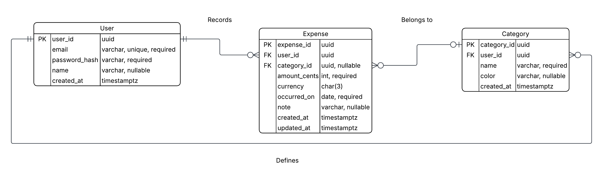

# DESIGN.md

## 1. Team Members

- Seth Pederson
- Reggie Womack
- David Hammond
- Winifred Halm De-Souza

**GitHub Repository:** [View Repo](https://github.com/snubsteel/SE3200-Expense-Tracker-2025-Group-2)
**Project Board** [View Project Board](https://github.com/users/snubsteel/projects/1)

### Milestone 1 Compliance Checklist

- [x] Team members listed
- [x] Link to forked GitHub repository
- [x] Link to public Project Board (GitHub Projects)
- [x] Backend Design Document with:
  - [x] Database schema (Users, Expenses, Categories) and relationships
  - [x] REST API specification with endpoints and request/response structures

---

## 2. Backend Design Overview

### Architecture Style

We use a hybrid architecture:

- **Client–Server**: React SPA communicates with a RESTful Node/Express API over HTTPS/JSON.
- **Layered Backend**:
  - **Controller** (HTTP endpoints, validation)
  - **Service** (business rules: totals, date ranges, ownership checks)
  - **Repository/ORM** (DB access via Prisma/Sequelize)
- **Data-Centered**: PostgreSQL as the persistent store.

### Key Components & Responsibilities

- **Auth Module**: registration, login, JWT issuance/verification, bcrypt password hashing.
- **Users Service**: profile retrieval, basic preferences.
- **Expenses Service**: CRUD, filtering by date/category, totals.
- **Categories Service**: CRUD (user-scoped default set).
- **Error & Logging Middleware**: consistent error shapes; request logging.
- **Security**: input validation, JWT auth middleware, role/user ownership checks, CORS, rate limit.

### Connectors

- React ⇄ Express: HTTPS/JSON (REST).
- Express layers: in-process function calls (Controller → Service → Repository).
- Repository ⇄ PostgreSQL: ORM over a pooled DB connection.

### Assumptions & Non‑Functional Requirements (brief)

- Multi-user: each user's data is isolated (row-level ownership on all tables).
- Security: JWT-based auth, hashed passwords (bcrypt), input validation, CORS, rate limiting.
- Reliability: server logs errors with structured JSON.
- Performance: basic pagination for lists; indexed queries by user/date/category.
- Portability: containerized services; environment-based configuration.

### Deployment Target

Railway: one service for API, one service for PostgreSQL. Environment variables for secrets (JWT_SECRET, DB_URL).

---

## 3. Database Schema

**Entities & Relationships**

- **User (1) — (∞) Expense**
- **User (1) — (∞) Category**
- **Category (1) — (∞) Expense** (nullable; uncategorized allowed)

**Diagrams**



**users**

- id (uuid, pk)
- email (varchar, unique, required)
- password_hash (varchar, required)
- name (varchar, nullable)
- created_at (timestamptz, default now())

**categories**

- id (uuid, pk)
- user_id (uuid, fk → users.id, on delete cascade)
- name (varchar, required)
- color (varchar, nullable)
- created_at (timestamptz, default now())
- **unique(user_id, name)**

**expenses**

- id (uuid, pk)
- user_id (uuid, fk → users.id, on delete cascade)
- category_id (uuid, fk → categories.id, on delete set null, nullable)
- amount_cents (int, required) // store money as integer cents
- currency (char(3), default 'USD')
- occurred_on (date, required)
- note (varchar, nullable)
- created_at (timestamptz, default now())
- updated_at (timestamptz, default now())
- **indexes**: (user_id, occurred_on), (user_id, category_id)

**Data rules**

- Users can only read/write their own rows.
- Category names are unique per user.
- Expense `amount_cents` > 0.

---

## 4. REST API Specification

**Endpoint Summary (quick scan)**

| Resource   | Method | Path                    | Purpose                    |
| ---------- | ------ | ----------------------- | -------------------------- |
| Auth       | POST   | `/api/auth/register`    | Create user                |
| Auth       | POST   | `/api/auth/login`       | Obtain JWT                 |
| Auth       | GET    | `/api/auth/me`          | Current user               |
| Categories | GET    | `/api/categories`       | List                       |
| Categories | POST   | `/api/categories`       | Create                     |
| Categories | PUT    | `/api/categories/:id`   | Update                     |
| Categories | DELETE | `/api/categories/:id`   | Remove                     |
| Expenses   | GET    | `/api/expenses`         | Query (filters/pagination) |
| Expenses   | POST   | `/api/expenses`         | Create                     |
| Expenses   | GET    | `/api/expenses/:id`     | Read                       |
| Expenses   | PUT    | `/api/expenses/:id`     | Update                     |
| Expenses   | DELETE | `/api/expenses/:id`     | Remove                     |
| Reports    | GET    | `/api/expenses/summary` | Aggregations               |

**Auth**

- `POST /api/auth/register`
  - Req: `{ "email": "a@b.com", "password": "Secret123!", "name": "Seth" }`
  - Res 201: `{ "id": "...", "email": "a@b.com" }`
- `POST /api/auth/login`
  - Req: `{ "email": "a@b.com", "password": "Secret123!" }`
  - Res 200: `{ "token": "<JWT>" }`
- `GET /api/auth/me` (Bearer token)
  - Res 200: `{ "id": "...", "email": "a@b.com", "name": "Seth" }`

**Categories** (auth required)

- `GET /api/categories` → list user categories
- `POST /api/categories`
  - Req: `{ "name": "Food", "color": "#33AA77" }`
  - Res 201: category
- `PUT /api/categories/:id`
  - Req: `{ "name": "Dining", "color": null }`
  - Res 200: updated category
- `DELETE /api/categories/:id` → 204

**Expenses** (auth required)

- `GET /api/expenses?from=2025-10-01&to=2025-10-24&categoryId=<id>&q=coffee&limit=50&offset=0`
  - Res 200: `{ "items":[...], "total":123, "count":50, "nextOffset":50 }`
- `POST /api/expenses`
  - Req: `{ "amount_cents": 1299, "currency":"USD", "occurred_on":"2025-10-23", "category_id": "<uuid>|null", "note":"Lunch" }`
  - Res 201: expense
- `GET /api/expenses/:id` → expense
- `PUT /api/expenses/:id` → update expense
- `DELETE /api/expenses/:id` → 204

**Example Objects**

```json
// Category
{ "id":"<uuid>", "user_id":"<uuid>", "name":"Food", "color":"#33AA77", "created_at":"2025-10-24T12:00:00Z" }

// Expense
{ "id":"<uuid>", "user_id":"<uuid>", "category_id":"<uuid|null>", "amount_cents":1299, "currency":"USD",
  "occurred_on":"2025-10-23", "note":"Lunch", "created_at":"2025-10-24T12:00:00Z", "updated_at":"2025-10-24T12:05:00Z" }
```

**Reports**

- `GET /api/expenses/summary?from=2025-10-01&to=2025-10-31&groupBy=category`
  - Res 200: `{ "rows":[ { "category":"Food","amount_cents": 34567 }, ... ] }`

**Error Model**  
All error responses use HTTP status codes and the shape:

```json
{
  "error": {
    "code": "STRING_CODE",
    "message": "Human-readable",
    "details": [
      /* optional */
    ]
  }
}
```

Common codes: `VALIDATION_ERROR`, `AUTH_REQUIRED`, `FORBIDDEN`, `NOT_FOUND`, `CONFLICT`, `RATE_LIMITED`.

**Conventions**

- **Auth**: `Authorization: Bearer <JWT>`
- **Errors**: `{"error": {"code":"VALIDATION_ERROR","message":"...", "details":[...]}}`
- **Validation**:
  - `email` valid format; `password` ≥ 8 chars
  - `amount_cents` positive int; `occurred_on` ISO date
  - only owner can access/modify resources
